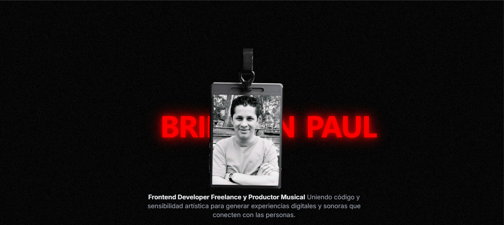

<div align="center">
  
  
  # 🌐 Página Oficial de **Brikman Paul**
  **Desarrollador Frontend Freelance**  
  🎨 Creando experiencias digitales que combinan diseño, tecnología y emoción.  
</div>

---

## 🧠 Sobre el Proyecto

Este repositorio contiene el código fuente de mi **página oficial** como desarrollador freelance.  
Inspirada en el estilo visual de [freddiebraun.com](https://www.freddiebraun.com/), fue construida **desde cero** utilizando **React**, **Node 22**, **Tailwind CSS**, y **Framer Motion**, enfocándome en **rendimiento, minimalismo visual y transiciones fluidas**.

Mi objetivo con este sitio es mostrar mi perfil profesional, proyectos destacados y mi enfoque artístico como **creador de experiencias digitales cinematográficas**.

---

## 🚀 Tecnologías Utilizadas

| Categoría | Tecnologías |
|------------|-------------|
| ⚛️ Frontend | React 19 • Vite • Next.js (referencias en otros proyectos) |
| 🎨 Estilos | Tailwind CSS • Framer Motion • Custom Animations |
| 🧩 Integraciones | React Player • Custom Hooks • Lazy Loading |
| 🧠 Backend / Node | Node.js 22 • NPM Scripts |
| 🧰 Herramientas | Git • Vercel • VS Code |

---

## 📸 Vista Previa del Sitio

<div align="center">
  
</div>

> 🎥 El sitio combina video, animaciones suaves y un diseño responsive para una experiencia visual inmersiva.

---

## 🧑‍💻 Sobre Mí

Soy **Brikman Paul**, desarrollador **Frontend Freelance** con más de **5 años de experiencia** creando interfaces limpias, fluidas y visualmente atractivas.  
Me especializo en **React**, **Next.js** y **tecnologías de diseño modernas** como Tailwind y Motion para llevar ideas a la pantalla con una identidad visual fuerte.  

> 💡 Creo en el código como una forma de arte: preciso, expresivo y emocional.

---

## ⚙️ Instalación del Proyecto

1. Clona este repositorio:

   ```bash
   git clone https://github.com/BrikmanP/pagina-oficial-brikman-paul.git
   cd pagina-oficial-brikman-paul
